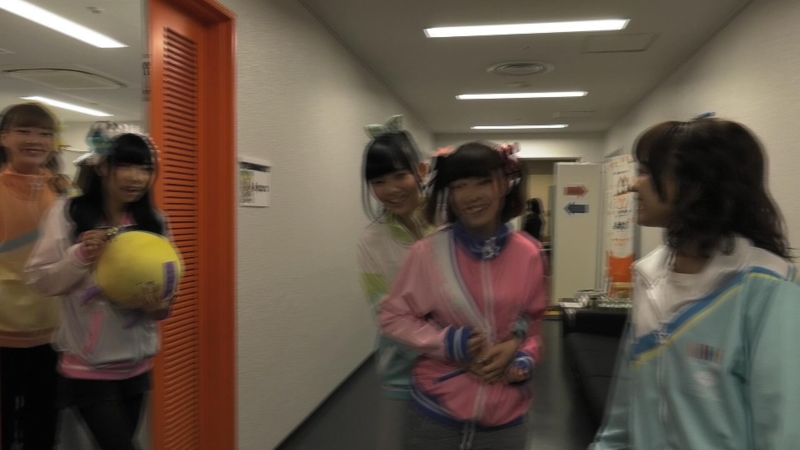
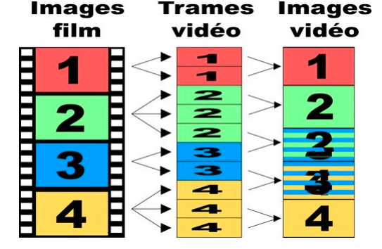

# 第十章 初等 30 fps 处理

## 什么是隔行扫描

要解释这个概念，要先从电视广播制式说起，世界上最常见的两种便是 NTSC 和 PAL，这些标准的制定与使用一定程度上受不同地区的家用交流电频率影响。

- NTSC：1 秒 30 帧或 60 场，主要由家用交流电频率为 60 Hz 的北美与日本使用
- PAL： 1 秒 25 帧或 50 场，主要由家用交流电频率为 50 Hz 的其他大部分国家地区使用，如大多数欧洲国家、中国

*由于我们主要说明的是日本动画等在日本播出的节目，所以下面如无特殊说明，介绍的均为 NTSC，两种制式的分别（如色彩）不再细说。*

「场（field）」这个名词已经在前面的教程中出现过，而它正是隔行扫描的产物。让我们回到 NTSC 制定的时代，那时的显示器大多使用的是 CRT（阴极射线管），它的显像原理简单来说就是电子束打到荧光粉来发亮，且受到了交流电频率的影响。逐行扫描是从左上角开始，从左到右从上到下地逐步点亮，1 秒内要显示 30 帧，但由于荧光粉的亮度衰减，人眼看起来会产生闪烁。所以当时采用了先从上至下扫描奇数行组成一场，再从上至下扫描偶数行组成一场的方式，1 秒内显示 60 场，光暗交叉看起来要好上很多，这种扫描方式便是隔行扫描（如下图）。随着技术的发展，CRT 也被 LCD 代替，现在已经很少见到，但隔行扫描的视频却仍然常见。


我们将奇数场称之为上半场（Top Field），偶数场称之为下半场（Bottom Field），显示上高度为正常帧高度的一半，即在同等带宽（无压缩）下，以空间分辨率（spatial resolution）减半，换取时间分辨率（temporal resolution）加倍。虽然上下半场可以合并为 1 帧，但扫描时间并不相同，时间差为 1/59.94s，所以在两场合并的帧上可能会出现交错条纹，或者说拉丝（如下图），也就是交错（Comb），这也是隔行扫描的典型特征。



*为什么 1 场是 1/59.94s 而不是 1/60s，这是因为在引入色彩时发生了 0.1% 的偏移，PAL 不存在这种现象。*

由于历史影响，日本制作生产的大部分节目帧率还是 24/1.001、30/1.001、60/1.001，为了简化讨论我们依次称之为 24fps、30fps、60fps，24/1 称之为 24.00fps，依次类推。

## 隔行扫描视频的种类

### 样例

下面的链接内有 5 个不同的视频，两个链接中的内容相同：

[百度网盘](https://pan.baidu.com/s/1aqzgdKnwWgQDehU6RvnQBw?pwd=k5dz)、[OneDrive](https://1drv.ms/f/s!Ahb382-S7-UugZ5l3MZUYZcJsD1vfA?e=MWHAxe)

#### sample1

其实是逐行扫描，偶尔看到的类似于交错的痕迹是缟缟，缟缟是对交错内容进行了错误处理导致的一种瑕疵。由于 Blu-ray 规范中只有 1920×1080 29.97i 而不允许 29.97p，所以在视频的信息标注上也是 29.97i，也就是伪装为隔行扫描视频的逐行扫描，一般我们称之为 30p。

#### sample2

帧帧交错的隔行扫描，我们一般称之为 30i。

#### sample3

大部分动画的帧率都是 24fps，但是会在帧率为 30fps 的电视广播中播出，在此中间便经过了一种名为 Telecine（胶卷过带）的处理，最常见的就是 3:2 pulldown（其实是 2:3 pulldown），具体做法如下图所示：



结果上看就是每 5 帧有 2 帧是交错的，即 PIIPP（3:2 pattern），又称作五烂二，每 3:2 个场的时间点相同，虽然仍避免不了卡顿但还算流畅。我们一般称之为 24t（24 telecine）。

#### sample4

承接上文，还有一种 Telecine 的处理方式，就是每 4 帧重复 1 帧，这样 24fps 就转换为了 30fps。结果上看就是每 5 帧有 1 帧是重复的，每 2:2:2:4 / 1:1:1:2 个场的时间点相同，称之为 2:2:2:4 pulldown，这样的卡顿感比 24t 更甚，我们一般称之为 24d（24 duplicate）。

### 总结

本节前文中的种类命名参考了 mawen1250 的 [ivtc_txt60mc使用教程 - 对于24t/24d+30i/30p混合源的处理](https://www.nmm-hd.org/newbbs/viewtopic.php?f=7&t=1367)，在学术上也许不严谨，但可以方便讨论。虽然有的未在样例中出现，但大概总结一下：

- 24p：逐行扫描，每秒 24/1.001 帧，每帧无交错
- 60p：逐行扫描，每秒 60/1.001 帧，每帧无交错
- 60i：隔行扫描，每秒 60/1.001 场，每帧不一定有交错，下面提到的几种均为此种的细分类型
- 30p：每帧无交错，可能是 30/1.001 帧的逐行扫描，也可能是每帧无交错的 60i，本篇讨论的多为后者
- 30i：每帧都是交错的 60i
- 24t（24 telecine）：60i 中每 5 帧有 2 帧是交错的，即 PIIPP（3:2 pattern）
- 24d（24 duplicate）：60i 中每帧无交错，每秒 30/1.001 帧，但每 5 帧有 1 帧是重复的


## 24p 的视频是怎么播放的

标准的制定来自于实践，但反过来，标准也会影响产业链。

相信大家已经知道，常见的日本动画帧率便是受到 NTSC 影响的 24p（24/1.001）。可能不太清楚的是如今电影放映的基本标准也是 24p（24/1），这一标准的制定受到人体本身、放映技术等层面的影响，而且电影行业标准的制定要远早于电视广播制式的制定，感兴趣的人可以去自行搜索电影放映速度及行业标准的变化，此处便不再赘述。然而电影实际制作的时候，选用的可能也是 NTSC 的 24p（24/1.001）。

视频是要用来看的，可能是电视广播，也可能是借助于 DVD / Blu-ray 这种碟片载体，也可能是电脑上的文件。为了使 24p 的视频能在不同设备上播放，业界也有很多技术对其进行处理。大概有下面几种：

1. 将 24p 重编码为 24t / 24d 在 NTSC 设备上播放
2. 将 24p 加速在 PAL 设备上播放
3. 给 24p 的视频添加 pulldown flags，使 NTSC 设备在播放时进行转换
4. 60Hz 显示器播放 24p 视频时，在每次屏幕刷新时重复显示视频的同一帧，直到下一帧的时间戳已经晚于屏幕刷新再显示下一帧，类似于 3:2 pulldown，这时出现的动态卡顿感也被称为 3:2 pulldown judder

### soft pulldown

第 1 种方式之前已经介绍过，我们着重说一下第 3 种方式，这种方式名为 soft telecine，又被称作 soft pulldown，与其相对应的重编码方法可以称作 hard telecine。

在视频的 24p 帧上添加一个 RFF（Repeat First Field）的 flag，播放设备在读取到这个 flag 的时候便会重复首场（TFF 时为顶场），一个正确的 repeat 如下表所示：

<table width="220px">
    <tr>
        <td style="width:120px;text-align:center">Source Frame</td>
        <td style="width:30px;text-align:center" colspan="2">1</td>
        <td style="width:20px;text-align:center" colspan="3">2</td>
        <td style="width:30px;text-align:center" colspan="3">3</td>
        <td style="width:20px;text-align:center" colspan="2">4</td>
    </tr>
    <tr>
        <td style="width:120px;text-align:center">TFF flag</td>
        <td style="width:30px;text-align:center" colspan="2">1</td>
        <td style="width:20px;text-align:center" colspan="3">0</td>
        <td style="width:30px;text-align:center" colspan="3">1</td>
        <td style="width:20px;text-align:center" colspan="2">0</td>
    </tr>
    <tr>
        <td style="width:120px;text-align:center">RFF flag</td>
        <td style="width:30px;text-align:center" colspan="2">0</td>
        <td style="width:20px;text-align:center" colspan="3">1</td>
        <td style="width:30px;text-align:center" colspan="3">1</td>
        <td style="width:20px;text-align:center" colspan="2">0</td>
    </tr>
    <tr>
        <td style="width:120px;text-align:center">Field</td>
        <td style="width:10px;text-align:center">1t</td>
        <td style="width:10px;text-align:center">1b</td>
        <td style="width:10px;text-align:center">2b</td>
        <td style="width:10px;text-align:center">2t</td>
        <td style="width:10px;text-align:center">2b_r</td>
        <td style="width:10px;text-align:center">3t</td>
        <td style="width:10px;text-align:center">3b</td>
        <td style="width:10px;text-align:center">3t_r</td>
        <td style="width:10px;text-align:center">4t</td>
        <td style="width:10px;text-align:center">4b</td>
    </tr>
    <tr>
        <td style="width:120px;text-align:center">Decode Frame</td>
        <td style="width:20px;text-align:center" colspan="2">1</td>
        <td style="width:20px;text-align:center" colspan="2">2</td>
        <td style="width:20px;text-align:center" colspan="2">3</td>
        <td style="width:20px;text-align:center" colspan="2">4</td>
        <td style="width:20px;text-align:center" colspan="2">5</td>
    </tr>
</table>

相较于 hard telecine，此种方法是无损的，而且可以节省传输的流量。由于 pulldown flag 可以只添加在视频流的一部分帧，所以真实的视频流帧率可能是变化的（vfr）而非恒定的（cfr）。

*但是实际情况与标准不同，flag 错误、pulldown 错误都屡见不鲜，正确地分辨与处理就要仔细检查和积累经验。*

## 隔行扫描视频的读取

我们在处理隔行扫描视频之前，首先要先学会如何正确地读取。

### DGMPGDec

首先先看一套有点「老」的软件 DGMPGDec，这是 Donald A. Graft 基于 DVD2AVI 开发的自由软件。可以从 https://www.rationalqm.us/dgmpgdec/dgmpgdec.html 获取源代码和相应配套组件。仅适用于 MPEG-1 和 MPEG-2，主要是后者，常见的大多是 DVD 和 Transport Stream。

*以下基于 v2.0.08*

包内对 vs 有用的只有 DGIndex 和 DGDecode，这里也只介绍我们可能会用到的 DGIndex 功能。

#### DGIndex

DGIndex 有一个 gui，基本操作是 `File - Open (F2)`，然后把需要加载的单个或多个文件 `ADD` 或拖拽上去，默认设置下 `File - Save Project (F4)` 会弹出 Information 窗口，显示结束后即可在源目录得到一个 `.d2v` 文件和 demux 的 `xxx DELAY xxxms.aac`。

- `.d2v` 中记录的源文件名是绝对路径
- 音频文件名上标注了需要 delay 的时间，mux 时可能会用到

之所以会 demux 音轨是因为 `Audio - Output Method` 默认是 `Demux All Tracks`，可以选择 `Disable` 不 demux 音轨（对应的是同目录配置文件 `DGIndex.ini` 中的 `Output_Method=0`）。

还有一个可能用到的重要选项 `Video - Field Operation`，它只对含有 pulldown flags 的视频有意义。

在介绍这个选项之前，需要先说明几个 DGMPGDec 中的概念：

- Film：相当于 24p，通常表现为 24t
- NTSC Video：可略称为 Video，相当于 30p，通常表现为 30i、30p
- Hybrid：film 与 video 的混合，可能是时间上的也可能是空间上的

回到 `Field Operation`：

1. Honor Pulldown Flags (Default)：模拟播放设备对标有 RFF 的场进行 repeat，返回 30fps clip。
2. Ignore Pulldown Flags：忽略 RFF，返回原始 clip（会记录在 d2v 文件中但不会处理），24fps 的视频被标注为 30fps 的帧率。
3. Force Film：将 24d 转换为 24p 并返回。

设置 Field Operation 的工作流程一般是这样的，先使用 `Honor Pulldown Flags`，观察 Information 中的 `Video Type`

1. 如果显示 NTSC 或 PAL 说明没有 pulldown flags，应继续使用之前生成的 d2v
2. 如果显示 Film 达到 95% 及以上（100% 也可被称为 Pure Film，此时无百分比显示）就可以使用 `Force Film` 得到 24p 的 clip，重新生成 d2v
3. 如果显示 Film 低于 95% 或显示 Video，应继续使用之前生成的 d2v

其实 DGIndex 也提供了 cli，示例：

`DGIndex.exe -i "xx.ts" -o "xx" -fo 0 -om 0`

- `-i`：指定输入的文件路径
- `-o`：指定输出的文件路径（包括文件名不包括文件扩展名）
- `-fo`：Field Operation， 0、1、2 依次对应 Honor Pulldown Flags、Force Film、Ignore Pulldown Flags
- `-om`：Output Method，0 - Disable、2 - Demux All Tracks

#### 读取 d2v 文件

d2v 文件结构可以从 `DGIndexManual.html` 中看，不再说明，主要说下怎么从 Vapoursynth 中加载 `.d2v`，有两种方法，一种是最近 port 的自带的 `dgdecode.MPEG2Source`，另一种是 `d2v.Source`。

DGIndex 的现代化替代品是 [D2VWitch](https://github.com/dubhater/D2VWitch)，与 `d2v.Source` 配套。

两个滤镜使用都很常规，指定 d2v 路径即可。只是对于 Force Film 生成的 d2v，`d2v.Source` 需要指定 `rff=False` 否则会得到一个帧率正确帧数错误的 clip。

*`dgdecode.MPEG2Source` 现在会在 clip 顶部与底部错误地各加 4px*

#### 其他

他还有一款与其类似的免费软件（原收费软件）[DGDecNV](http://rationalqm.us/dgdecnv/dgdecnv.html)，除 MPEG-2 外还支持 AVC、HEVC 等现代常用的编码格式。但仅支持 NVIDIA 显卡，且不太适合 MPEG-2 源的处理。

### LWLibavSource

在实际流程中，我们用到 DGMPGDec 的时候有点少，一是 OKE 没有支持，二是只能读取 MPEG-2。一般使用的还是在基础滤镜篇章源滤镜部分提到的 LWLibavSource，DGMPGDec 更多时候是用于验证与比对。主要是对于 LWLibavSource 参数 `repeat` 的使用，其他与加载常规视频源相同。`repeat` 只对含有 pulldown flags 的视频生效，也就是说如果视频中不含有 pulldown flags，`repeat` 的值无论为多少都会返回原本的视频。下面是不同 `repeat` 值对 soft pulldown 视频的处理。

1. 值为 `False` 或 `0` 时，不做任何处理，返回源视频，即
    
    - 如果源是 24fps 和 30fps 混合返回帧率不明的 vfr clip
    - 如果源全是 24fps（也就是 pure film）返回 24p clip（与 DGIndex 的 `Force Film` 行为相同），但帧率不一定正确，可能需要 `std.AssumeFPS(fpsnum=24000, fpsden=1001)`

2. 其他值时，像播放器一样根据 pulldown flags 对需要重复的场进行 repeat，如果成功则返回一个 30fps 的 clip（与 DGIndex 的 `Honor Pulldown Flags` 行为相同，但结果更为可靠），如果失败：
    
    - 若值为 `True` 或 `1`，显式报错
    - 若值为 `2`，与 `0` 时相同，返回帧率不明的 vfr clip

pulldown flags 处理失败，可能是因为视频流破损、后期剪辑失误、超出 lsmas 处理能力等。  
对于返回的 vfr clip 也需要仔细检查，看起来正常但不一定正确。  
而且哪怕是 `repeat=1` 成功返回了 cfr clip，也要仔细检查帧顺序是否正确，如果出现问题可以从 [Github repo issues](https://github.com/AkarinVS/L-SMASH-Works/issues) 回报。

总之，处理中一般应使用更为严格安全的 `repeat=1`（默认值），repeat 失败再使用 `repeat=0`。如果是查看老一些的脚本或使用旧版本的滤镜（vA.2 之前版本）时，你可能会发现 `repeat` 只有 True 与 False 两种，旧有的 True 就是现在的 `repeat=2`。

#### 检测是否为全程 soft pulldown（pure film）

可以使用 DGIndex，也可以用以下方法。

假设 repeat = 1 / 2 / True 时，读取到的视频帧数为 x，repeat = 0 / False 时读取到的视频帧数为 y，如果符合 `| 0.8 * x – y| < 1` 则可以认为源视频是全程 soft pulldown，可以使用 `repeat=0` 得到 24p 的视频进行后处理，否则必须要开启 `repeat=1`。~~当然就算是完美的 soft pulldown，开启 `repeat=1` 读取后再进行 IVTC 也没有问题。~~示例脚本：

```python
import vapoursynth as vs
from vapoursynth import core

source_file = "a.ts"

def isSoftPulldown(src, debug=False) -> vs.VideoNode:
    a = core.lsmas.LWLibavSource(source_file, repeat=0)
    b = core.lsmas.LWLibavSource(source_file, repeat=1)

    if debug:
        return b
    else:
        return a if abs(b.num_frames * 0.8 - a.num_frames) < 1 else b
```

## 隔行扫描视频的常规处理

正常情况下，我们要将隔行扫描视频正确地处理回逐行视频再进行后续的处理，下面就说下如何处理，顺序还是依照上面 sample 的顺序。

### 指定 FieldBased（30p）

因为只是标记为 60i，视频本身仍为逐行扫描，所以只需要使用 `core.std.SetFieldBased(src, 0)` 将 Frameprops 中的 `_FieldBased` 标记为 0（Progressive）即可，通常在将隔行扫描的视频处理为逐行扫描的视频后都要如此操作，因为这样可以避免后续处理的滤镜读取到错误的 Frameprops 进行了错误的处理。

缟缟的处理放到后面。

### deint（30i）

需要对源视频进行「反交错（deinterlace / deint）」。一些常见的 deint 滤镜有：

- [EEDI2](https://github.com/AmusementClub/VapourSynth-EEDI2)
- [EEDI3mod](https://github.com/AmusementClub/VapourSynth-EEDI3)
- [znedi3](https://github.com/sekrit-twc/znedi3)
- [TDeintMod](https://github.com/HomeOfVapourSynthEvolution/VapourSynth-TDeintMod)

最简单的便是半场反交错，如 `core.znedi3.nnedi3(src, field=1)`，直接扔掉下半场，只用上半场插补出整帧，这样帧率保持不变，变为场率的一半。但这种直接没了一半信息的做法实在过于粗暴，所以我们可以先进行分场，再对每场进行插补，如下所示：

```python
field_clip = core.std.SeparateFields(src, tff=True)
res = core.znedi3.nnedi3(field_clip, field=1, dh=True)
```

现在帧率与场率相同了，但由于上下半场基线本就不同，所以必然会上下抖动。对此我们可以使用 havsfunc 中的一个 function QTGMC，它的原型是 TempGaussMC，是进行了时域的运动补偿，详细内容会在后面篇章说明。我们先简单使用一下它：

```python
from vapoursynth import core
import havsfunc as haf

src = core.lsmas.LWLibavSource(source_file)
res = haf.QTGMC(src, TFF=True, Preset="Slower", FPSDivisor=2)
res.set_output()
```

`Preset` 是速度和质量相关的预设；`FPSDivisor=2` 会在全部处理后抽出奇数帧输出，最终结果为 30p，某种意义上可以减少编码帧数，加快编码速度和降低码率。

通常保持帧率不变的处理成为 deint，帧率翻倍的处理为 bob。

### ivtc（24t 与 24d）

3:2 pulldown 上文已经说过，24t 的场排序为（1上，1下）、（2上，2下）、（2上，3下）、（3上，4下）、（4上，4下）。要想将其还原回 24p，就需要先进行场匹配（Frame Match）转换为 24d，即固定上半场不变，按规则与相邻帧的下半场进行组合，选择成品画面中拉丝最少的作为最终结果，变成了（1上，1下）、（2上，2下）、（2上，2下）、（3上，3下）、（4上，4下），最后以 5 帧为循环抽取并删除重复的一帧，转换为 24p。这套流程就叫做 IVTC（inverse telecine），一些常见的 IVTC 滤镜有：

- [TIVTC](https://github.com/dubhater/vapoursynth-tivtc)：tritical 开发的一款 Avisynth 滤镜，后来由 dubhater 于 2021 年移植到 Vapoursynth
- VIVTC：VS 内置滤镜之一，是由 VS 开发者当年重写的 TIVTC，相比少了一些功能，同样参数的效果也会有一些不同
- a60224：Avisynth 滤镜，目前没有 VS 移植
- [IT](https://github.com/HomeOfVapourSynthEvolution/VapourSynth-IT)

在这，先简单介绍下 vivtc，tivtc 放到后续篇章中。

1. 场匹配（vfm）

    `matched = core.vivtc.VFM(src, mode=1)`

    - vfm 只支持 8-bit 输入
    - mode：决定场匹配的方式和强度，范围 0-5。  
    强度随数字变大逐步增大，越小越安全，但可能匹配不上，开大了也有可能会匹配错误

2. 删除重复帧（vdecimate）

    `res = core.vivtc.VDecimate(matched)`

    - vdecimate 支持 8-16 bit 输入

3. 后处理

    场匹配不可能完美，但 vfm 会给无法匹配的帧添加 `_Combed=1` 的 frameprop，于是可以自己做 deint 来处理这些帧

以下为一种简单的处理方式：

```python
import vapoursynth as vs
from vapoursynth import core
import havsfunc as haf
import functools

def pp(n, f, clip, deinterlaced):
   if f.props['_Combed'] > 0:
      return deinterlaced
   else:
      return clip

src = core.lsmas.LWLibavSource(source_file)
matched = core.vivtc.VFM(src, 1)
deint = haf.QTGMC(matched, TFF=True, FPSDivisor=2)
pp_clip = core.std.FrameEval(matched, functools.partial(pp, clip=matched, deinterlaced=deint), prop_src=matched)
res = core.vivtc.VDecimate(pp_clip)
```

24d 就是从第 2 步开始，不再赘述。

### vfr

如前文 soft pulldown 部分所说，实际视频流中的 fps 不一定是恒定的，可能是时间上的多种类型的混合。也就是看起来是 60i 的视频，其中可能是 24d、30i、30p、24d 按时间的混合，这种时候应该对不同类型进行分别处理，最后再合并起来得到一个可变帧率（vfr）的视频。

#### timecode

之前介绍过，播放端通过读取视频容器内的 timestamp 来渲染帧，而 timecode 文件正是一种封装在容器中记录帧时间的文本文件，常见的格式有 v1、v2 两种。v1 只是简单记录每个帧数区间的帧率，v2 则会详细记录每一帧的时间戳。

皆是以 0 帧作为起始帧，空格会被忽略。

##### timecode v1

```
# timecode format v1
assume 25
800,1000,23.97
1500,1700,29.970
```

- 首行记录格式版本
- 次行记录未指定范围的帧率，帧率为浮点数
- 依次记录起止两端闭合区间及帧率

这种格式更易于人类书写与查看。

##### timecode v2

```
# timestamp format v2
0
40
80
```

- 首行记录格式版本
- 各行依次是顺序各帧的时间戳，时间戳精度为毫秒，浮点数

#### vs 生成 timecode 文件

示例：`res = mvsfunc.VFRSplice([30i_clip, 30p_clip, 24t_clip], tcfile="foobar.tcfile", v2=True)`

- 第一个参数是做完了 ivtc、deint 等的 clip 按照顺序组成的 list
- tcfile 指定生成的 tcfile 的输出路径
- v2 输入布尔值，决定输出的 tcfile 是 v1 还是 v2

最后得到一个由 list 里的 clip 连接起来的 vfr clip 和一个 timecode file。

#### 怎样预览和输出 vfr

上节我们得到了一个 vfr clip 和一个 tcfile。

##### 使用 VS 预览 vfr

先用 vseditor 来预览一下这个 vfr clip，可以发现标注的 fps 为 `0/0`。再换成 vspreview 预览，发现会弹出报错，因为 vspreview 无法处理 fps 为 0 的情况，那可以在 vfr clip 后追加一个 `AssumeFPS` 再 `set_output`。如下示例：

```python
# …

vfr_clip = mvsfunc.VFRSplice([clip1, clip2], tcfile="foobar.tcfile", v2=True)

# simple
res1 = vfr_clip.std.AssumeFPS(fpsnum=30000, fpsden=1001).set_output(2)

# safe
res2 = vfr_clip.std.AssumeFPS(fpsnum=(clip1.num_frames + clip2.num_frames)*1000, fpsden=(clip1.num_frames/clip1.fps+clip2.num_frames/clip2.fps)*1001).set_output(3)
```

##### 从 vfr 视频中提取 timecode

`ffms2.Source(timecodes="tcfile.txt")`

##### 编码器编码 vfr

1. x264 可以直接使用参数指定 `--tcfile-in "foobar.tcfile"`
2. x265 没有 vfr 支持，但可以输入输出 cfr 视频，再在封装时指定 timecode

##### 封装 vfr

1. l-smash
    
    - gui 可以直接指定 timecode file
    - cli 需要先按正常流程封装 mp4，再使用 `timelineeditor` 重新封装：`.\timelineeditor.exe --timecode "foobar.tcfile" cfr.mp4 vfr.mp4`

2. mkvmerge

    看 doc

3. oke

    在配置文件中，指定 TimeCode 项为 True，便会启用 vfr 输出，且不再检查 fps 信息，封装 mkv 时将输入文件同路径下的同名 tcfile 封装进去


## 被错误处理的隔行视频

### 缟缟

重新打开 sample1，可以看到像下图一样有一些很像交错特征，实际上又不是的东西：


简单的缟缟处理非常简单，使用 `havsfunc.daa()` 即可。
